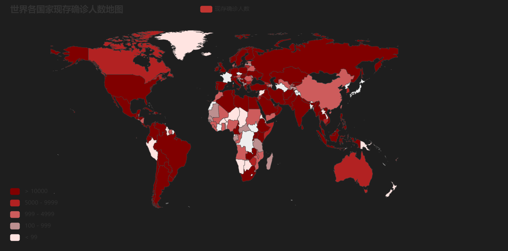
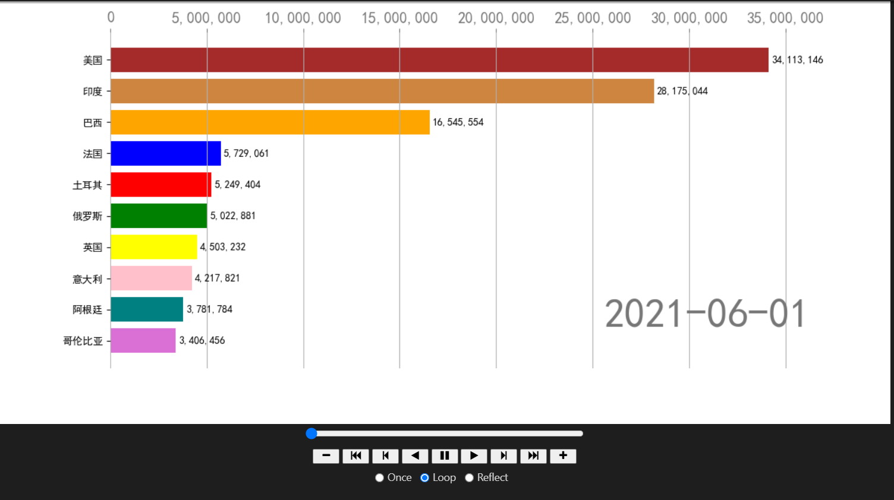
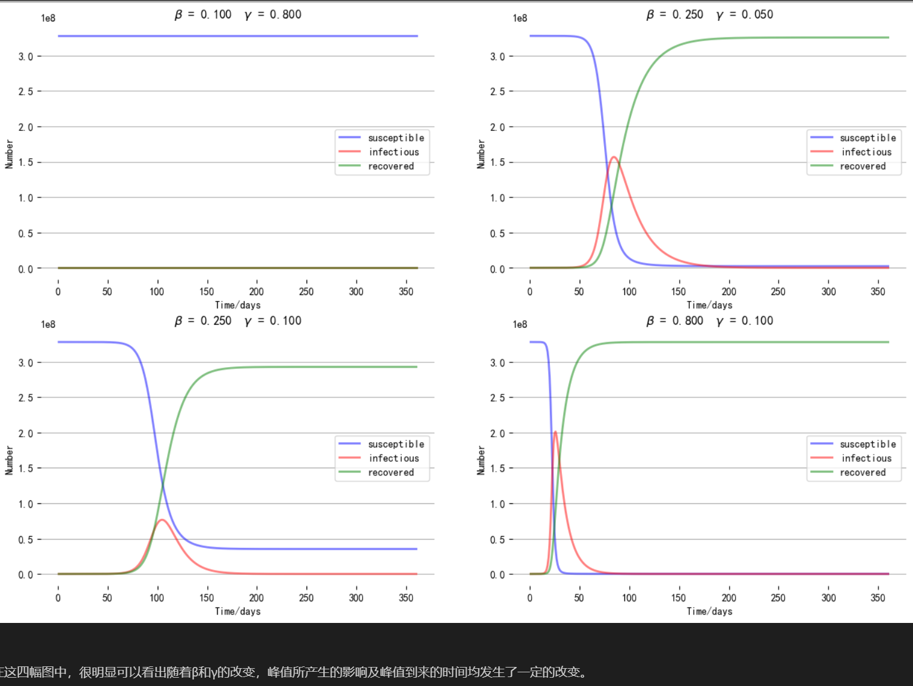

# COVID-19-Analysis-Visualization

## 前言

本项目是《本科-数据分析》课程自选大作业。我们组选择的题目是《新冠疫情大数据分析》。项目所使用的数据爬取自网上公共数据，并对爬取的数据进行分析及建模。

## 实验环境

pandas == 0.20.1

matplotlib == 2.0.2

requests == 2.14.2

numpy == 1.12.1

scipy == 0.19.0

## 数据来源

本次数据来源均为团队使用python爬取，考虑到难度和反爬虫机制，经过查阅一些博客信息后，最后选择爬取目标为网易新闻客户端，并且我们成功的查到了网易新闻的全球疫情部分的api，极大的方便了我们下一步的爬取数据集工作。

## 分析过程

- 对爬取的疫情数据进行处理
  - 缺失值处理
  - null处理
  - etc

- 数据分析可视化
  - matplotlib绘图	
    - 绘制多个国家的累计确诊人数折线图
    - 绘制各国新增确诊人数折线图
    - 中国新冠肺炎的累计确诊和当日新增确诊绘制
  - pyecharts绘图
    - 世界各国家现存确诊人数地图
    - 世界国家累计确诊人数动态条形图

- 模型建立与评估
  - SIR模型原理(探究拟合参数β、γ对美国疫情的影响)

## 结果展示

世界各国家现存确诊人数地图
    

世界国家累计确诊人数动态条形图

喜欢的小伙伴点个stars吧~